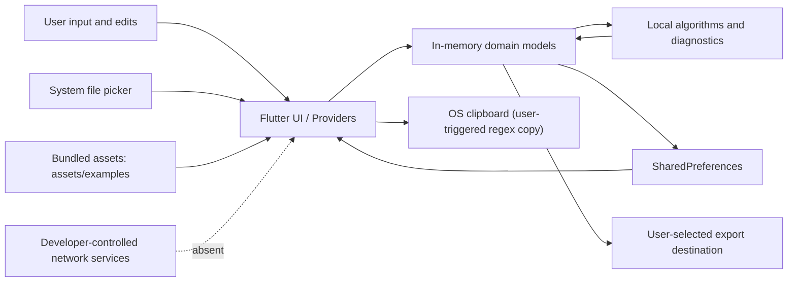

# Data Flow

Date: 2026-04-22

This document records the data Turing Lab stores, processes, imports, and exports.
It is intended to support Apple submission work and future privacy maintenance.

For SharedPreferences keys, persistence gaps, and restoration behavior, see
[PERSISTENCE.md](./PERSISTENCE.md).

For Apple submission wording and category-by-category App Privacy answers, see
[APP_PRIVACY_APPLE.md](./APP_PRIVACY_APPLE.md).

## Privacy posture summary

- Turing Lab does not send user data to developer-controlled servers.
- Turing Lab does not include analytics, crash reporting, ads, user accounts, or device identifier collection.
- Turing Lab stores only local settings and local simulation-trace data in app storage.
- File import and export are user-initiated through the system file picker.
- Bundled examples are shipped as app assets and loaded locally.

## Data categories

| Category | Data handled | Storage location | Retention | Leaves device |
| --- | --- | --- | --- | --- |
| Settings | Theme mode, empty-string symbol, epsilon symbol, grid visibility, coordinate visibility, auto-save toggle, tooltip toggle, grid size, node size, font size, animation speed | `SharedPreferences` | Persists until changed, cleared, or app uninstall | No |
| Unified trace history | Input strings, acceptance result, per-step simulation data, optional automaton type/id, trace metadata, current step index | `SharedPreferences` (`trace_history`, `current_trace`, `trace_metadata`; reads legacy `simulation_trace_history` and `current_simulation_trace` when unified keys are absent) | Persists across launches; history capped to 50 entries | No |
| Active editor automata/session | Current automaton/grammar/PDA/TM being edited, current canvas state, algorithm state | In memory only during normal editor use | Until replaced, app restart, or process exit | No |
| Bundled examples | Predefined example automata and grammars with metadata | App bundle assets under `assets/examples/`, plus in-memory cache after load | Assets persist with the app install; cache lasts for the process lifetime | No |
| Imported files | User-selected `.jff`, `.cfg`, and `.json` contents parsed into app models | Read from system file picker into memory; raw file contents are not copied into app storage by Turing Lab | Only during import, unless user then keeps the parsed model open or saves/export traces separately | Not by the app; source files may reside in user-selected providers such as On My iPhone or iCloud Drive |
| Exported files | User-created `.jff`, `.cfg`, `.json`, `.svg`, and `.png` outputs | Written only to the user-selected destination from the system save dialog | User-controlled outside the app | Potentially, if the user chooses a cloud-backed provider; Turing Lab does not upload to developer infrastructure |
| In-app diagnostics | Validation messages, severity, suggestions, simulation-failure explanations | In memory only | Until the view refreshes or the process exits | No |
| Local debug/console logs | Error messages, stack traces, and some development diagnostics that may include model or input details | Local console / system log only | Platform-controlled; not managed by app storage | No upload path in app code |

## Data flow diagram

## Local storage details

### Settings

- Backed by `SharedPreferencesSettingsRepository` and `SharedPreferencesSettingsStorage`.
- Stored as simple key/value settings only.
- For storage keys and restore behavior, see [PERSISTENCE.md](./PERSISTENCE.md).

### Trace persistence

- The active trace flows persist simulation inputs and step-by-step results locally.
- Stored trace fields include input string, acceptance state, execution time, step list, optional computation tree, current step index, and trace metadata such as timestamp and automaton type.
- For storage keys, caps, and restore behavior, see [PERSISTENCE.md](./PERSISTENCE.md).

### Automata and grammars

- The main editor state is primarily in-memory and is not restored on cold start today.
- There is no active `SharedPreferences` persistence path for editor automata after the unused local data source cleanup.
- Imported automata and grammars are parsed directly from user-selected files; the raw source file is not copied into app-managed storage.

### Diagnostics

- The on-screen diagnostics panel is generated locally from the current automaton and simulation state.
- Diagnostics are not persisted.
- Developer-facing `debugPrint` and `print` statements exist in the codebase; they stay local unless a tester or user manually extracts device logs.

## File import/export flows

### Accepted imports

- Automata JFLAP XML: `.jff`
- Grammar JFLAP XML: `.cfg`
- Automaton JSON: `.json`
- Some algorithm flows also read a second `.jff` automaton through the system picker for comparisons and binary operations.

### Exported formats

- Automata JFLAP XML: `.jff`
- Grammar JFLAP XML: `.cfg`
- Automaton JSON: `.json`
- Automaton/grammar/PDA/TM SVG: `.svg`
- Automaton PNG: `.png`

### What is extracted on import

- JFLAP automata: state IDs, state names, state positions, initial/final markers, and transitions.
- JFLAP grammars: start symbol and productions.
- Automaton JSON: full serialized automaton model including IDs, timestamps, states, transitions, alphabet, bounds, zoom, and pan offset.
- No hidden metadata extraction code was found beyond the modeled file contents being parsed into app structures.

### What is embedded on export

- JFLAP/XML exports contain only the modeled automaton or grammar content needed for that format.
- JSON exports contain the serialized automaton model, including model IDs, timestamps, layout bounds, zoom, and pan offset.
- SVG exports contain the rendered diagram content and a visible title based on the model name by default; no author, analytics, tracking, or device metadata is added.
- PNG exports are rendered from an in-app canvas to raw image bytes; no explicit EXIF or custom metadata-writing path was found.

### Important Apple/privacy distinction

- Imports and exports are user-directed file operations.
- On Apple platforms, the user may choose local storage or a cloud-backed Files provider such as iCloud Drive.
- That does not create a developer-operated collection channel, because Turing Lab does not directly transmit the file contents to a backend service.

## What the app does NOT do

Absent from the current repo audit:

- HTTP, WebSocket, or other app-level network client code in `lib/`, `ios/`, `android/`, or `macos/`
- Analytics SDKs
- Crash-reporting SDKs
- User-account, sign-in, or profile systems
- Advertising SDKs or tracking SDKs
- Device-identifier access APIs
- iOS privacy permission usage strings for contacts, camera, microphone, photo library, location, health, or payments

## Platform notes

### iOS

- `ios/Runner/Info.plist` contains standard app metadata and orientation settings only.
- No iOS privacy permission usage strings were found.

### Android

- The release manifest at `android/app/src/main/AndroidManifest.xml` does not declare `INTERNET`.
- Debug and profile manifests do include `INTERNET` for development tooling.

### macOS

- `macos/Runner/Release.entitlements` grants sandboxed user-selected file read/write only.
- `macos/Runner/DebugProfile.entitlements` additionally includes `com.apple.security.network.server` for debug/profile builds.
- No corresponding app-level networking code was found in the repo.

## Dependencies audit

- No share-sheet plugin dependency is currently declared in `pubspec.yaml`.
- Sharing remains a maintenance watchpoint because adding a share plugin later would create a new user-controlled disclosure path that should be documented.

## Privacy Checklist

Use this checklist before every Apple submission and whenever privacy-relevant
code changes land. For the App Store Connect wording that should stay in sync
with this section, see [APP_PRIVACY_APPLE.md](./APP_PRIVACY_APPLE.md).

- Do not add analytics SDKs without updating both this file and [APP_PRIVACY_APPLE.md](./APP_PRIVACY_APPLE.md).
- Do not add crash-reporting or telemetry SDKs without updating both privacy documents and the App Store Connect answers.
- Do not add direct network calls (`http`, `dio`, sockets, WebSockets, native networking) without updating both privacy documents and re-evaluating whether `Data Not Collected` still applies.
- Do not read device identifiers such as IDFV, IDFA, Android device IDs, or equivalent platform identifiers without updating both privacy documents.
- Do not add account, sign-in, profile, sync, or cloud-backend features without updating both privacy documents.
- Do not add new iOS privacy permission usage strings to `Info.plist` without updating both privacy documents.
- Do not treat user-selected file import/export as developer data collection unless the app starts transmitting those files or related metadata to a backend.
- If a share plugin or system share-sheet integration is added later, document the new disclosure path even if it remains user-initiated.

## Maintenance Checklist

Before each Apple submission, re-check the following:

1. Confirm no analytics, crash, ad, or auth packages were added to `pubspec.yaml`.
2. Confirm no new `http`, `dio`, socket, or WebSocket usage was added in `lib/` or native platform code.
3. Confirm iOS `Info.plist` still has no new privacy-sensitive usage strings unless intentionally added.
4. Confirm exported files still avoid author/device/tracking metadata.
5. Confirm no new share plugin or share-sheet integration was added without updating this document and the Apple privacy answers.
6. Confirm any new background sync, cloud backup, or account features are reflected in `APP_PRIVACY_APPLE.md`.
