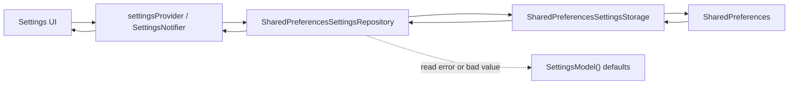
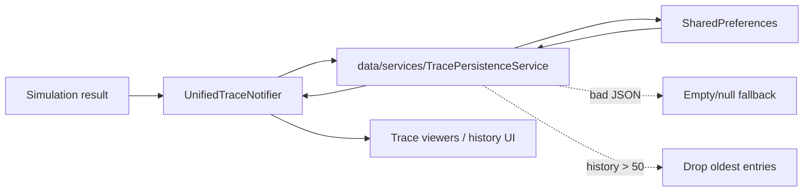
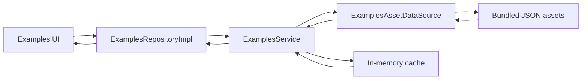

# Persistence

Date: 2026-07-13

## Summary

Turing Lab currently persists four kinds of data locally:

- Settings in `SharedPreferences`
- Simulation traces in `SharedPreferences`
- Active editor sessions in `SharedPreferences` when Auto Save is enabled
- Bundled examples in app assets

Turing Lab restores the active editor session on cold start when the user's Auto Save setting is enabled. The previous unused local automata data source has been removed; active editor persistence is now handled by the Riverpod session coordinator and a compact `SharedPreferences` snapshot.

## What Persists

| Area | Storage | Persisted today | Restored on app relaunch | Notes |
| --- | --- | --- | --- | --- |
| Settings | `SharedPreferences` | Yes | Yes | Fail-open: defaults are used if reads fail or values are malformed. |
| Unified trace history | `SharedPreferences` | Yes | Yes | Stored by the data-layer `TracePersistenceService`, which also reads legacy core trace keys when unified keys are absent. |
| Current unified trace position | `SharedPreferences` | Yes | Yes | Restored by `UnifiedTraceNotifier` on construction. |
| Offline examples | Bundled assets | Yes | Yes | Loaded lazily from `assets/examples/`; no network dependency. |
| Active editor automaton/session | `SharedPreferences` | Yes, when Auto Save is enabled | Yes, when Auto Save is enabled | Stores FSA, Grammar, PDA, TM, and Regex input state in typed schema envelopes, plus the active workspace's stable formal-system key. |

## SharedPreferences Keys

### Active Keys

| Key | Owner | Purpose |
| --- | --- | --- |
| `settings_empty_string_symbol` | `SharedPreferencesSettingsRepository` | User-selected symbol for the empty string. |
| `settings_theme_mode` | `SharedPreferencesSettingsRepository` | Theme preference: `system`, `light`, or `dark`. |
| `settings_show_grid` | `SharedPreferencesSettingsRepository` | Whether the editor grid is shown. |
| `settings_show_coordinates` | `SharedPreferencesSettingsRepository` | Whether node coordinates are shown. |
| `settings_auto_save` | `SharedPreferencesSettingsRepository` | Controls active editor session persistence. When disabled, the session snapshot is cleared and skipped on cold start. |
| `settings_show_tooltips` | `SharedPreferencesSettingsRepository` | Whether contextual tooltips are shown. |
| `settings_grid_size` | `SharedPreferencesSettingsRepository` | Grid spacing in logical pixels. |
| `settings_node_size` | `SharedPreferencesSettingsRepository` | Node size in logical pixels. |
| `settings_font_size` | `SharedPreferencesSettingsRepository` | Base UI/font size. |
| `settings_animation_speed` | `SharedPreferencesSettingsRepository` | Animation speed multiplier. |
| `trace_history` | Data-layer `TracePersistenceService` | Unified trace history used by `UnifiedTraceNotifier`. |
| `current_trace` | Data-layer `TracePersistenceService` | Active trace plus current step index for relaunch restoration. |
| `trace_metadata` | Data-layer `TracePersistenceService` | Supplemental metadata indexed by trace ID. |
| `simulation_trace_history` | Data-layer `TracePersistenceService` compatibility read | Legacy/core trace history read when `trace_history` is absent. |
| `current_simulation_trace` | Data-layer `TracePersistenceService` compatibility read | Legacy/core current trace read when `current_trace` is absent. |
| `active_editor_session` | Data-layer `ActiveSessionPersistenceService` | Last editor session snapshot used to restore workspaces on relaunch when Auto Save is enabled. |

## Persistence Architecture

### Settings

- Settings are loaded through `settingsProvider` -> `SettingsNotifier` -> `SharedPreferencesSettingsRepository` -> `SharedPreferencesSettingsStorage`.
- Reads are fail-open:
  - missing keys fall back to `SettingsModel()` defaults,
  - malformed values fall back per field,
  - invalid `themeMode` values fall back to `system`.
- Writes are strict:
  - save failure still throws inside the repository,
  - `SettingsNotifier.update()` catches and logs the error,
  - the in-memory provider state still reflects the attempted update.

### Unified Trace History

- Newer trace persistence uses the data-layer `TracePersistenceService`.
- `UnifiedTraceNotifier` loads trace history and current trace state on construction.
- History truncates silently to 50 entries.
- Malformed persisted data is sanitized:
  - malformed history JSON returns `[]`,
  - malformed current trace returns `null`,
  - malformed metadata returns `{}`,
  - malformed entries inside otherwise valid collections are dropped individually.

### Offline Examples

- Examples are not stored in `SharedPreferences`.
- They are bundled as assets under `assets/examples/`.
- `ExamplesService` loads them lazily via `ExamplesAssetDataSource` and caches them in memory.
- No examples are preloaded during DI setup or app startup.

### Active Editor Session

- The active FSA, Grammar, PDA, TM, and Regex input state plus the current
  `FormalSystemKey` live in Riverpod state during a run. Navigation positions
  are derived from registry order and are not the persisted identity.
- `activeSessionPersistenceProvider` restores one saved snapshot during app startup and then listens to editor providers for changes.
- `ActiveSessionPersistenceService` stores a versioned
  `active_editor_session` JSON payload in `SharedPreferences`. Version 2 stores
  each document with its formal-system key, schema ID, schema version, and
  typed payload. Version 0 and 1 snapshots are migrated from the historical
  workspace index and rewritten in the current envelope.
- A future envelope or document-schema version is preserved under a recovery
  backup key and surfaced as unsupported. Malformed data or a corrupt schema
  identity remains fail-open: it is cleared and startup continues.
- Pumping Lemma explicitly declares session persistence unavailable, so the
  active workspace can be restored without fabricating a Pumping document.
- Saves are debounced during active editing and serialized through one write at a time. Pending snapshots are flushed when the app becomes inactive, hidden, paused, or detached and when the provider is disposed. Platform termination can still end the process before an asynchronous `SharedPreferences` write finishes, so lifecycle flushes are bounded best-effort durability rather than a synchronous shutdown guarantee. Malformed persisted session data is cleared and ignored so startup remains fail-open.
- If `settings_auto_save` is false, startup restore is skipped and the stored session snapshot is cleared.

## Fail-Open Pattern

Settings use a deliberate fail-open design:

- If `SharedPreferences` is unavailable during startup, DI falls back to an in-memory preferences store so the app can still boot.
- If individual settings keys are missing or corrupted, only those fields fall back to defaults.
- The app prefers a usable default state over a startup failure caused by settings corruption.

Tradeoff:

- This prevents settings corruption from bricking the app.
- It also means users can lose preferences silently if the underlying store is corrupted.

## Data-Loss Scenarios

### 1. Active automata are lost on every app restart

Severity: Critical (resolved when Auto Save is enabled)

What happens:

- The current editor state lives in Riverpod memory and is mirrored into `active_editor_session` while Auto Save is enabled.
- Restarting the app restores the saved FSA, Grammar, PDA, TM, Regex input
  state, and active workspace by stable formal-system key.
- Disabling Auto Save clears the session snapshot and intentionally prevents cold-start restore.

Recommendation:

- Keep the current single-session snapshot focused on cold-start data-loss prevention.
- Consider a recent-session stack or explicit editor checkpoints if classroom workflows need multiple recoverable drafts.

### 2. Trace history silently truncates at 50 entries

Severity: Medium

What happens:

- The data-layer trace service caps `trace_history` at 50 entries.
- The core trace service also defaults to a 50-entry limit.
- The oldest entries are discarded without any user-facing warning.

Recommendation:

- Surface the cap in UI or settings.
- Consider configurable retention for the data-layer trace flow.
- Add export/archive if long-term trace retention matters.

### 3. Settings revert to defaults if SharedPreferences is corrupted

Severity: Medium

What happens:

- Settings loads fail open.
- Missing or malformed keys revert to `SettingsModel()` defaults.
- Users may lose preferences without an explicit recovery prompt.

Recommendation:

- Keep the fail-open startup behavior.
- Add optional user-visible diagnostics when settings are repaired/reset.
- Consider checksums/versioning if future migrations become more complex.

### 4. No backup or export/import mechanism for user settings

Severity: Medium

What happens:

- Settings exist only in local `SharedPreferences`.
- Reinstall, device migration, or corruption can remove them permanently.

Recommendation:

- Add explicit settings export/import.
- Consider platform backup support later, but start with an app-level portable format.

### 5. Current startup fallback can preserve uptime but not original settings data

Severity: Low

What happens:

- If preferences initialization fails at startup, DI falls back to an in-memory store.
- The app remains usable, but persistence for that run is effectively temporary.

Recommendation:

- Log clearly when the fallback is active.
- Expose this state in diagnostics/support tooling if startup preference failures recur in the field.

## Follow-Up Ticket Recommendations

### Ticket: Persist active automata locally

Status: Implemented for the active session when Auto Save is enabled.

Impact:

- Removes the highest-risk data-loss scenario.
- Makes cold-start restoration meaningful for editor work, not just settings and traces.

Remaining future scope:

- Define conflict behavior for import/export and multiple automata sessions.
- Consider recent-session history if one active-session snapshot is not enough.

### Ticket: Implement the `autoSave` setting behavior

Status: Implemented for active editor session persistence.

Impact:

- Aligns persisted settings with active editor session behavior.
- Lets users control cold-start editor restoration instead of storing a dead preference.

Remaining future scope:

- Decide whether Auto Save should also cover explicit export checkpoints.
- Surface Auto Save behavior in user-facing help if classroom workflows need clearer recovery expectations.

### Ticket: Add settings export/import

Priority: P1

Impact:

- Reduces settings loss during reinstall, migration, or corruption.
- Gives support and QA a simple way to reproduce user environments.

Suggested scope:

- Export `SettingsModel` as JSON.
- Import with validation and per-field fallback.
- Consider bundling trace-retention preferences and future persistence metadata.

## Known Gaps

- **Active-session model restoration:** implemented for the latest FSA,
  Grammar, PDA, TM, Regex input, and active workspace when Auto Save is enabled.
  It is a single versioned snapshot, not a history of recoverable sessions.
- **Flutter UI restoration:** not implemented. Navigation stacks, scroll
  offsets, focus, dialogs, selections, and other transient widget state do not
  use `RestorationMixin` or `restorationScopeId`.
- **Retention/history:** trace history is capped at 50 entries and active editor
  persistence retains only the latest session snapshot. There is no
  user-facing trace-truncation warning or multi-session recovery UI.
- **Backup/export:** there is no portable backup/export path for settings,
  active-session snapshots, or retained trace history.
- No user-facing warning when settings are repaired or reset.

## Related Files

- `lib/data/repositories/settings_repository_impl.dart`
- `lib/data/storage/settings_storage.dart`
- `lib/data/services/trace_persistence_service.dart`
- `lib/data/services/examples_service.dart`
- `lib/data/data_sources/examples_asset_data_source.dart`
- `lib/injection/dependency_injection.dart`
- `lib/presentation/providers/settings_provider.dart`
- `lib/presentation/providers/unified_trace_provider.dart`
